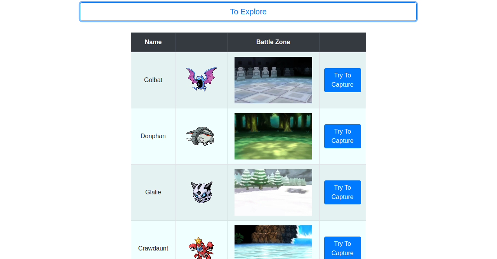
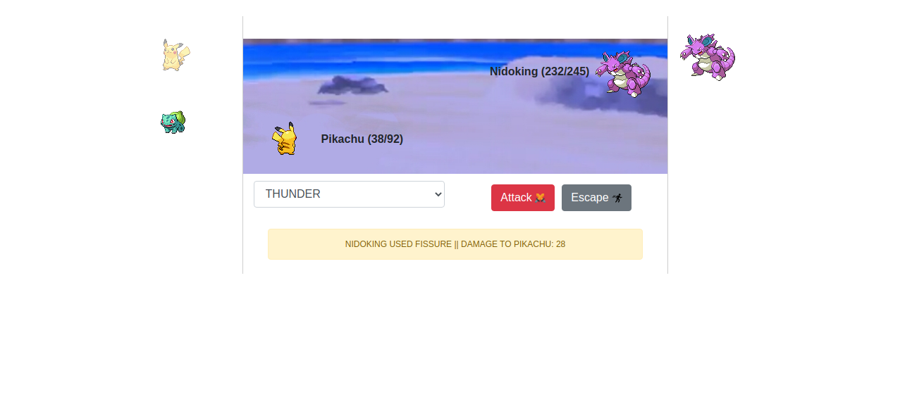

# Um simples jogo de Pokémon para prática de ReactJS :electron:

Principais conceitos praticados:

<ul>
<li><b>Componentes Funcionais</b></li>
<li><b>React Router</b> (<b>Link</b>, <b>BrowserRouter</b>, <b>Switch</b>, <b>Route</b>)</li>
<li><b>Axios</b></li>
<li><b>Hooks</b> (<b>useState</b>, <b>useEffect</b>)</li>
<li><b>sessionStorage</b></li>
<li><b>Funções assíncronas</b></li>
</ul>

Inspirado no minicurso de ReactJS ofertado no WTISC 2020 pelo <b>professor</b> Jefferson <b>Carvalho</b>, porém com um esquema de batalha mais detalhado e uma abordagem React funcional (Veja <a href="https://github.com/jeffersoncarvalho/WTISC-POKEMON">aqui</a> o projeto do minicurso).

### HOME : Tente capturar os pokémons nas mais variadas zonas de combate durante sua jornada.

### THE POKÉDEX : Nunca esqueça de verificar sua Pokédex para adquirir informações sobre nossos amigos pokémons.

### BATTLE : Batalhe para capturar pokémons!!! Lembre-se de que a zona de combate e o tipo dos pokémons influenciam nos danos de batalha!!!

